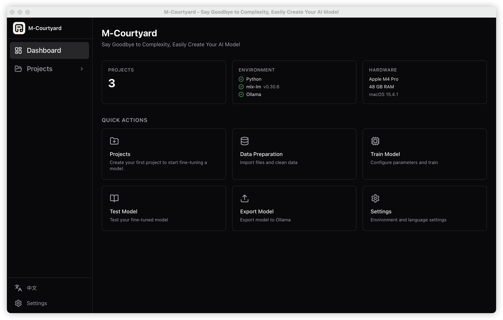
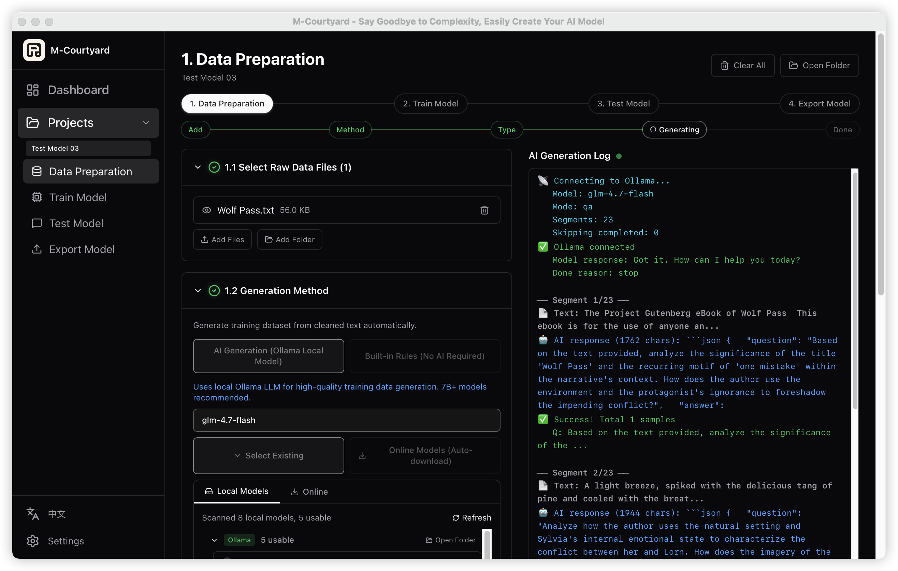
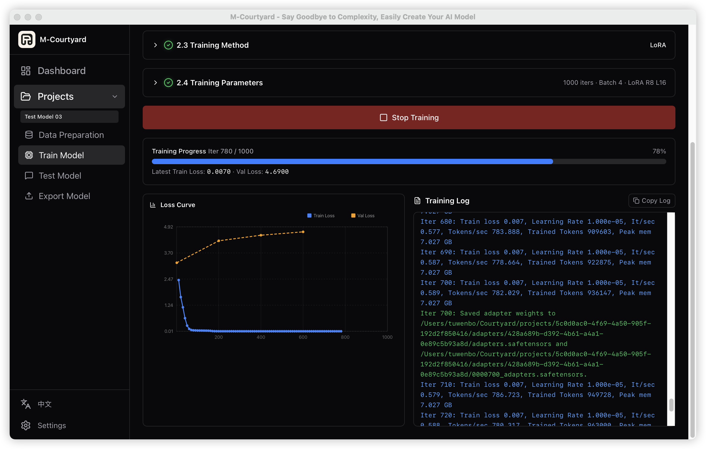
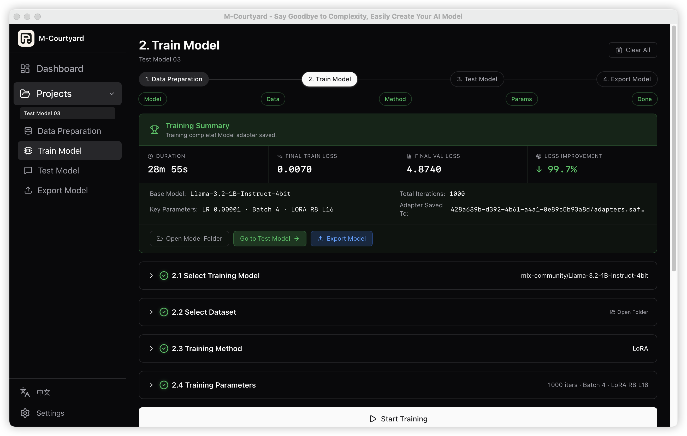
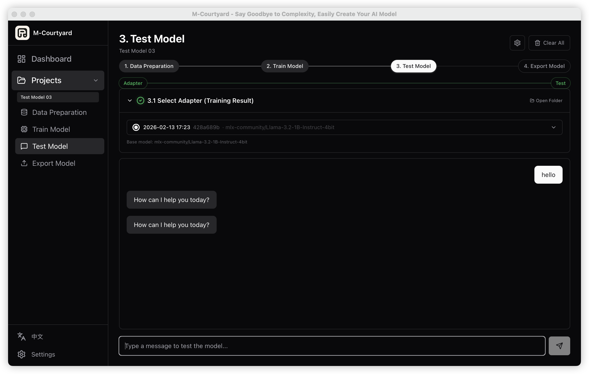
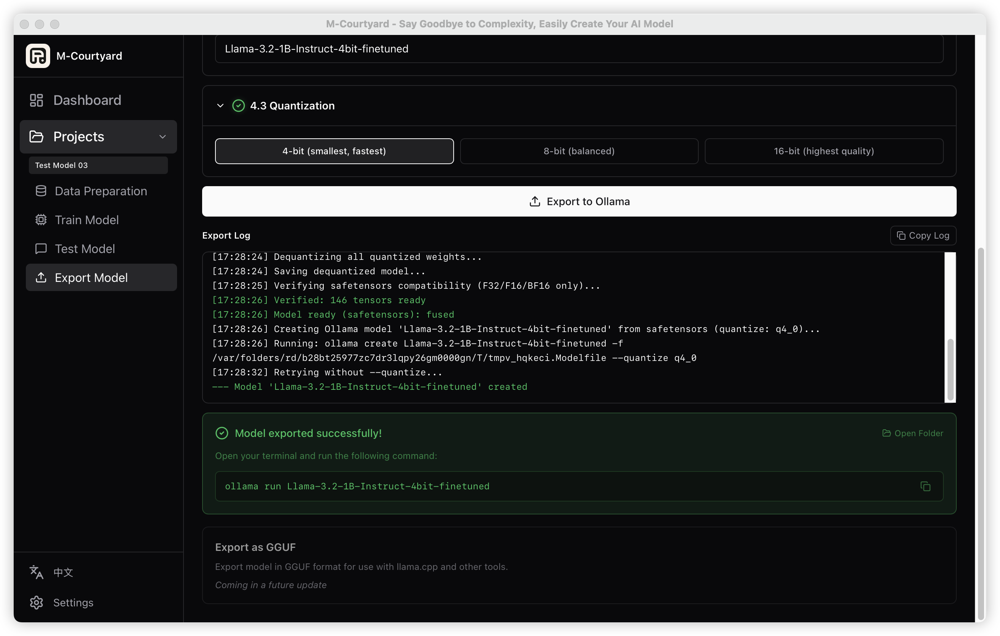

<div align="center">

<!-- TODO: 替换为实际的产品 Banner 图 -->
<!--  -->

# 🏡 M-Courtyard

**告别繁琐，简单创建您的AI大模型**

*从原始文档到可部署的 Ollama 模型 — 全程在你的 Mac 上完成。*

[](https://github.com/Mcourtyard/m-courtyard/stargazers)
[](https://github.com/Mcourtyard/m-courtyard/releases)
[](https://github.com/Mcourtyard/m-courtyard/releases/latest)
[](LICENSE)
[](https://github.com/Mcourtyard/m-courtyard/commits/main)
[](https://discord.gg/v9ajdTSZzA)

**[English](./README.md)** | 中文

</div>

---

## 为什么选择 M-Courtyard？

大多数微调工具依赖命令行、需要云端支持，或者需要手动拼接多个脚本。M-Courtyard 将**完整流程**封装为一个引导式桌面应用 — 基于 [Ollama](https://ollama.com) + [mlx-lm](https://github.com/ml-explore/mlx-examples/tree/main/llms/mlx_lm)：

| 步骤 | 功能说明 |
|------|---------|
| **1. 数据准备** | 导入文档（txt/docx/pdf）→ 自动清洗 → AI 生成训练数据集（知识问答/风格模仿/多轮对话/指令训练） |
| **2. 训练模型** | 选择基础模型 → 选择数据集 → 配置 LoRA 参数 → 实时 Loss 曲线 + 进度条 |
| **3. 测试模型** | 与微调后的适配器对话，验证效果 |
| **4. 导出模型** | 一键导出为 Ollama 可用模型（Q4/Q8/F16 量化） |

> **100% 本地运行。无需云服务。无需 API Key。数据不出本机。**

<div align="center">
  
  <p><em>仪表盘 — 环境状态、快捷操作、项目概览</em></p>
</div>

<details>
<summary><strong>📸 更多截图（点击展开）</strong></summary>
<br/>

<div align="center">
  
  <p><em>数据准备 — AI 自动生成训练数据，实时日志</em></p>
</div>

<div align="center">
  
  <p><em>模型训练 — 实时 Loss 曲线和迭代进度</em></p>
</div>

<div align="center">
  
  <p><em>训练总结 — 耗时、Loss 指标、99.7% 改善率</em></p>
</div>

<div align="center">
  
  <p><em>测试模型 — 与微调后的模型对话</em></p>
</div>

<div align="center">
  
  <p><em>导出模型 — 一键导出到 Ollama，支持量化</em></p>
</div>

</details>

## 下载安装

> **大多数用户直接下载预构建应用即可。** 从源码构建仅用于开发。

| 平台 | 芯片 | 下载 |
|------|------|------|
| macOS 14+ | Apple Silicon (M1/M2/M3/M4) | [📦 下载 .dmg](https://github.com/Mcourtyard/m-courtyard/releases/latest) |

> **⚠️ macOS 安全提示**
> 由于应用未使用 Apple 开发者证书签名，macOS 可能提示"已损坏"。按以下步骤解决：
> 1. 照常安装：打开 DMG，将应用拖入 `/Applications` 文件夹
> 2. 打开 **终端**（聚焦搜索 → 输入"终端"或"Terminal"）
> 3. 执行以下命令：
>    ```bash
>    sudo xattr -rd com.apple.quarantine /Applications/M-Courtyard.app
>    ```
> 4. 系统会提示输入 **Mac 登录密码**（输入时密码不会显示，这是正常现象）
> 5. 完成！现在从"应用程序"中打开 M-Courtyard 即可正常使用

<!-- TODO: 支持更多平台后在此添加 -->

## 最新更新 — v0.4.3

**批量处理** — N 个文件一次操作，离开去喝杯茶，完成收到通知。

- **多文件拖拽导入** — 直接将文件或文件夹拖入 1.1 区域，自动跳过已导入的重复文件
- **生成队列视图** — 生成过程中文件列表变为实时队列：折叠行显示当前文件 + 分段进度，展开可见每个文件的状态（✓ 已完成 / ⟳ 生成中 / ○ 等待中）
- **生成统计栏** — 预览区下方卡片实时显示文件 N/M、已生成数量、成功率（颜色区分）
- **训练队列** — 训练按钮旁新增「加入队列」，支持多组实验连续排队执行
- **合并为单数据集** — 开关控制最终输出是合并为一个数据集还是每个文件单独生成
- **macOS 完成通知** — 全链路生成完成后推送系统通知

[查看完整更新日志 →](CHANGELOG.md)

---

## 核心特性

### 数据处理与生成
- **批量多文件导入** — 拖拽导入多个文件，队列化生成并实时显示每文件进度
- **AI 数据集生成** — 利用本地大模型自动将文档转换为高质量训练数据
- **多种生成类型** — 知识问答 / 风格模仿 / 多轮对话 / 指令训练
- **内置规则生成** — 无需 AI 也可基于规则模板生成基础训练数据
- **增量保存 & 断点恢复** — 每条数据即时保存，中断后可从断点恢复

### 模型训练
- **训练队列** — 多组实验排队连续执行，无需等待上一次完成再手动启动
- **mlx-lm LoRA 训练** — 基于 Apple MLX 框架，充分利用 Apple Silicon 统一内存
- **实时训练可视化** — Loss 曲线图、迭代进度条、实时日志
- **多来源模型** — 自动检测 Ollama 模型，扫描本地 HuggingFace/ModelScope 缓存，在线自动下载
- **可配置下载源** — 在设置中切换 HuggingFace / HF 镜像源（国内加速）/ ModelScope
- **训练预设** — 快速 / 标准 / 深度 三种配置满足不同需求

### 导出与部署
- **一键导出到 Ollama** — 支持 Q4/Q8/F16 量化格式
- **通用模型支持** — Qwen、DeepSeek、GLM、Llama、GPT-OSS、Kimi、Mistral、Phi 等
- **适配器管理** — 管理和测试多个微调后的适配器

### 用户体验
- **四步引导式流程** — 统一进度条 + 子步骤时间轴
- **macOS 通知** — 生成流程完成后推送系统通知
- **全流程本地运行** — 数据不出本机，隐私安全
- **防睡眠** — 长时间任务自动阻止系统进入睡眠
- **国际化** — 支持中文和英文界面，可在设置页面切换

## 系统要求

| 项目 | 要求 |
|------|------|
| 操作系统 | macOS 14+ (Sonoma 或更高) |
| 芯片 | Apple Silicon (M1/M2/M3/M4 系列) |
| 内存 | 建议 16GB+（7B 模型微调），8GB 可运行 3B 模型 |
| 依赖 | [Ollama](https://ollama.com)（AI 生成用）· uv（Python 环境管理，自动检测） |

## 快速开始

### 方式一：下载安装包（推荐）

1. 前往 [**Releases**](https://github.com/Mcourtyard/m-courtyard/releases/latest) 下载最新 `.dmg` 文件
2. 打开 `.dmg` 文件，将 **M-Courtyard.app** 拖入应用程序文件夹
3. 启动 M-Courtyard — 开始使用！

### 方式二：从源码构建

<details>
<summary>点击展开构建步骤</summary>

**前置条件：**

| 工具 | 安装方式 |
|------|---------|
| Node.js 18+ | [nodejs.org](https://nodejs.org) 或 `brew install node` |
| pnpm | `npm install -g pnpm` |
| Rust 工具链 | `curl --proto '=https' --tlsv1.2 -sSf https://sh.rustup.rs \| sh` |
| Xcode 命令行工具 | `xcode-select --install` |
| Ollama | [ollama.com](https://ollama.com) |

**构建步骤：**

```bash
# 1. 克隆仓库
git clone https://github.com/Mcourtyard/m-courtyard.git
cd m-courtyard/app

# 2. 确保 Rust 已加入 PATH（首次安装后需要）
source "$HOME/.cargo/env"

# 3. 安装前端依赖
pnpm install

# 4a. 开发模式（热更新，快速迭代）
pnpm tauri dev

# 4b. 或者：构建发布版本（生成 .app / .dmg）
pnpm tauri build
```

**构建产物：**

| 产物 | 位置 |
|------|------|
| `.app` 应用 | `src-tauri/target/release/bundle/macos/M-Courtyard.app` |
| `.dmg` 安装包 | `src-tauri/target/release/bundle/dmg/M-Courtyard_<version>_aarch64.dmg` |

> **注意：** `pnpm tauri dev` 开发模式下，macOS Dock 图标会显示为 Tauri 默认图标。自定义应用图标仅在生产构建（`pnpm tauri build`）后生效。

</details>

## 技术栈

| 层级 | 技术 |
|------|------|
| 前端 | React 19 + TypeScript + TailwindCSS v4 + Vite |
| 桌面框架 | Tauri 2.x (Rust) |
| 状态管理 | Zustand |
| AI 推理 | Ollama（本地 HTTP API） |
| 模型训练 | mlx-lm (Apple MLX Framework, LoRA) |
| Python 环境 | uv + venv（自动管理） |
| 数据存储 | SQLite + 本地文件系统 |
| 国际化 | 中文 & 英文 |

## 项目结构

```
m-courtyard/
├── app/
│   ├── src/                      # React 前端
│   │   ├── pages/                # 页面组件（数据准备、训练、测试、导出）
│   │   ├── components/           # 共享组件（StepProgress、ModelSelector 等）
│   │   ├── stores/               # Zustand 状态管理
│   │   ├── services/             # 服务层（项目、训练）
│   │   └── i18n/                 # 国际化 (en / zh-CN)
│   ├── src-tauri/                # Rust 后端
│   │   ├── src/commands/         # Tauri IPC 命令
│   │   ├── src/python/           # Python 子进程管理
│   │   ├── scripts/              # Python 脚本（清洗/生成/导出/推理）
│   │   └── icons/                # 应用图标
│   └── package.json
├── LICENSE                       # AGPL-3.0 许可证
├── README.md                     # English
└── README_zh-CN.md               # 本文件
```

## 使用流程

1. **创建项目** — 为你的微调任务创建一个独立项目空间
2. **数据准备** (1.1~1.5)
   - 导入原始文件（txt / docx / pdf）
   - 自动清洗（去噪、修复编码、智能分段）
   - 选择生成方式（AI 生成 / 内置规则）和生成类型
   - 一键生成训练数据集
3. **训练模型** (2.1~2.4) — 选择基础模型 → 选择数据集 → 配置 LoRA 参数 → 开始训练
4. **测试模型** (3.1~3.2) — 选择训练好的适配器，与微调后的模型对话测试
5. **导出模型** (4.1~4.3) — 选择适配器 → 命名 → 选择量化格式 → 一键导出为 Ollama 模型

## 许可证

本项目采用 [GNU Affero General Public License v3.0](LICENSE) 许可。

如需以其他条款使用 M-Courtyard（如商业许可），请联系：**tuwenbo0112@gmail.com**

## 贡献

欢迎参与贡献！以下是参与方式：

1. **Fork** 本仓库
2. 创建功能分支：`git checkout -b feat/your-feature`
3. 使用 [Conventional Commits](https://www.conventionalcommits.org/) 提交：`git commit -m "feat: add new feature"`
4. 推送到你的 Fork：`git push origin feat/your-feature`
5. 向 `main` 分支发起 **Pull Request**

请注意：
- Commit message 请使用**英文**
- 遵循现有代码风格
- 新功能请附带测试

## 社区

- [Discord](https://discord.gg/v9ajdTSZzA) — 聊天、求助、分享你的微调模型
- [GitHub Discussions](https://github.com/Mcourtyard/m-courtyard/discussions) — 功能建议、问答、公告
- [GitHub Issues](https://github.com/Mcourtyard/m-courtyard/issues) — Bug 报告和功能请求

## 支持项目

如果觉得 M-Courtyard 对你有帮助：
- 给个 ⭐ — 让更多人发现这个项目！

## Star History

<!-- TODO: 有一定 Star 后取消注释 -->
<!-- [](https://star-history.com/#Mcourtyard/m-courtyard&Date) -->
